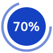
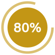
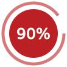

# Steps indicator

This shell script creates a series of visual SVG indicators you could use to show progress on slides.

# Usage

This is pure shell and should run on most Linux or macOS. Invoke from command line to generate your very own indicators.

    ./mkdots.sh <steps>
    ./mkprogress.sh <percent_increment>

## dotline

Let's say you need a 8 steps indicator, run `./mkdots.sh 8`. This will generate the following SVG files:

 
 
 
 
 
 
 
 

## progress report with status

Now, image you need a progress a report. You want it rounded to 5% increments. Running `./mkprogress.sh 5` will generate progress indicators to suit your needs. Best of all, it supports _levels_ as of INFO, WARNING and DANGER:

# Configuration

The renderers are fully configurable thru custom _config_ files.

## dotline

Some options can be tweaked to suit your mood. You should edit `.config_dots` to override default settings.

    CIRCLE_RADIUS=8                  # guess what?
    COLOR_BACKGROUND="#ffffff"       # avoid transparent SVG
    COLOR_INNER_CURRENT="#1542c3"    # current step color
    COLOR_INNER_DONE="#ffffff"       # past steps color
    COLOR_INNER_NEXT="#ffffff"       # upcoming steps color
    COLOR_OUTER_CURRENT="#1542c3"    # current step color
    COLOR_OUTER_DONE="#1542c3"       # past steps color
    COLOR_OUTER_NEXT="#999999"       # upcoming steps color
    OUTPUT_PNG=1                     # produce PNG as well
    PADDING=5                        # outermost padding
    STROKE_WIDTH=1                   # speaks for itself

Beware of the `OUTPUT_PNG` option. It relies on `convert`. This script checks for `convert` prior trying to use it. So don't expect PNGs if `convert` is not available to you.

## progress report with status

Some options can be tweaked to suit your mood. You should edit `.config_progress` to override default settings.

    CIRCLE_OUTER_RADIUS=50           # progress indicator radius
    CIRCLE_INNER_RADIUS=40           # status dot radius
    COLOR_BACKGROUND="#ffffff"       # avoid transparent SVG
    COLOR_INNER_INFO="#1542c3"       # status dot color for INFO level
    COLOR_INNER_WARNING="#c39615"    # status dot color for WARNING level
    COLOR_INNER_DANGER="#bb2124"     # status dot color for DANGER level
    COLOR_OUTER_INFO="#728ddb"       # progress indicator color for INFO level
    COLOR_OUTER_WARNING="#dbc072"    # progress indicator color for WARNING level
    COLOR_OUTER_DANGER="#d6797b"     # progress indicator color for DANGER level
    FONT_COLOR="#ffffff"             # percent completion text color
    FONT_FAMILY="Verdana"            # percent completion font fammily
    FONT_SIZE=25                     # percent completion text size
    OUTPUT_PNG=1                     # produce PNG as well
    PADDING=5                        # outermost padding
    STROKE_WIDTH=5                   # width of progress indicator
    WRITE_VALUE=1                    # add caption

Beware of the `OUTPUT_PNG` option. It relies on `convert`. This script checks for `convert` prior trying to use it. So don't expect PNGs if `convert` is not available to you. At the moment, `convert` does not properly handles SVG argument _dominant-baseline_, so text won't be vertically centered on PNGs.

# Dependencies

Well, there's basically no dependency. Anyway, as stated above, `ImageMagick` is required for generating PNGs. You might install it using any package manager.